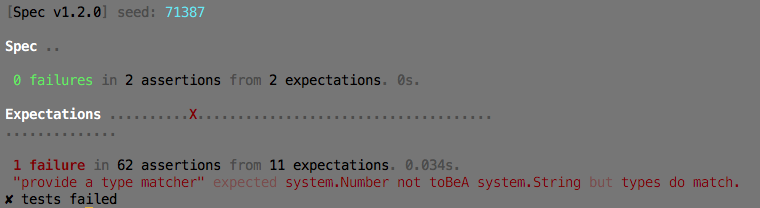

spec-ls
=======

a simple specification framework for [Loom][loom-sdk]

- [installation](#installation)
- [usage](#usage)
- [building](#building)
- [contributing](#contributing)




## installation

Download the library into its matching sdk folder:

    $ curl -L -o ~/.loom/sdks/sprint34/libs/Spec.loomlib \
        https://github.com/pixeldroid/spec-ls/releases/download/v1.1.5/Spec-sprint34.loomlib

To uninstall, simply delete the file:

    $ rm ~/.loom/sdks/sprint34/libs/Spec.loomlib


## usage

0. import Spec, a Reporter, and your specifications
0. have the specifications describe themselves to Spec
0. add your reporter(s) to Spec and execute

```ls
package
{
    import loom.Application;

    import pixeldroid.bdd.Spec;
    import pixeldroid.bdd.reporters.ConsoleReporter;


    public class SpecTest extends Application
    {

        override public function run():void
        {
            MySpec.describe();

            Spec.addReporter(new ConsoleReporter());
            Spec.execute();
        }
    }


    import pixeldroid.bdd.Thing;

    public static class MySpec
    {
        public static function describe():void
        {
            var it:Thing = Spec.describe('a Thing');

            it.should('exist', function() {
                it.expects(MySpec).not.toBeNull();
            });
        }
    }

}
```

### matchers

spec-ls has a basic set of expectation phrases for specifying behavior:

* `toBeA(type:Type)`
* `toBeEmpty()`
* `toBeFalsey()` / `toBeTruthy()`
* `toBeGreaterThan(value2:Number)` / `toBeLessThan(value2:Number)`
* `toBeNaN()`
* `toBeNull()`
* `toBePlusOrMinus(absoluteDelta:Number).from(value2:Number)`
* `toContain(value2:Object)`
* `toEndWith(value2:String)` / `toStartWith(value2:String)`
* `toEqual(value2:Object)`
* `toPatternMatch(value2:String, matches:Number=1)`

they are defined in [Matcher.ls][Matcher.ls];
you can see them used in the specifications for spec-ls itself: [ExpectationSpec][ExpectationSpec.ls]

### reporters

spec-ls ships with three reporters:

* **AnsiReporter** - prints a compact summary to the console using ANSI color codes
* **ConsoleReporter** - traces the complete results with a minimum of frill
* **JunitReporter** - writes jUnit style xml summaries for CI systems like Jenkins and Bamboo

..or create your own by implementing the simple [Reporter][Reporter.ls] interface.

### random seed

by default, Spec will execute tests in a different random order every time, to guard against accidental order dependencies.

to reproduce the order of a specific run, pass in the same seed value to `Spec.execute()`:

```ls
        override public function run():void
        {
            MySpec.describe();

            Spec.addReporter(new ConsoleReporter());

            var seed:Number = 97;
            Spec.execute(seed);
        }
```

see [SpecTest][SpecTest.ls] for an example of how to read the seed value from the command-line.


## building

first, install [loomtasks][loomtasks] and the [spec-ls library][spec-ls]

### compiling from source

    $ rake lib:install

this will build the Spec library and install it in the currently configured sdk

### running tests

    $ rake test

this will build the Spec library, install it in the currently configured sdk, build the test app, and run the test app.


## contributing

Pull requests are welcome!


[ExpectationSpec.ls]: test/src/spec/ExpectationSpec.ls "ExpectationSpec.ls"
[loom-sdk]: https://github.com/LoomSDK/LoomSDK "a native mobile app and game framework"
[loomtasks]: https://github.com/pixeldroid/loomtasks "Rake tasks for working with loomlibs"
[Matcher.ls]: lib/src/pixeldroid/bdd/Matcher.ls "Matcher.ls"
[Reporter.ls]: lib/src/pixeldroid/bdd/Reporter.ls "Reporter.ls"
[spec-ls]: https://github.com/pixeldroid/spec-ls "a simple spec framework for Loom"
[SpecTest.ls]: test/src/app/SpecTest.ls "SpecTest.ls"
