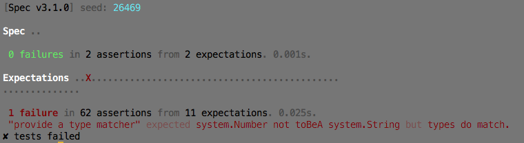

spec-ls
=======

a simple specification framework for [Loom][loom-sdk]



- [installation](#installation)
- [usage](#usage)
- [building](#building)
- [contributing](#contributing)


## installation

Download the library into its matching sdk folder:

    $ curl -L -o ~/.loom/sdks/sprint34/libs/Spec.loomlib \
        https://github.com/pixeldroid/spec-ls/releases/download/v2.0.0/Spec-sprint34.loomlib

To uninstall, simply delete the file:

    $ rm ~/.loom/sdks/sprint34/libs/Spec.loomlib


## usage

### in a nutshell

0. import `Spec`, one or more `Reporter`s, and one or more specifications
0. add the reporter(s) to an instance of `Spec`
0. in the specifications, describe the desired behavior of the thing they validate
  * `Spec.describe()` instantiates a `Thing`
  * `Thing.should()` declares a requirement function
    - in the function, `expects()` and `asserts()` validate the requirement
0. execute the spec to see results from the reporter

### simple example

```ls
package
{
    import loom.Application;

    import pixeldroid.bdd.Spec;
    import pixeldroid.bdd.reporters.ConsoleReporter;

    import WidgetSpec;


    public class SpecTest extends Application
    {

        override public function run():void
        {
            var spec:Spec = new Spec();
            spec.addReporter(new ConsoleReporter());

            WidgetSpec.specify(spec);

            spec.execute();
        }
    }


    import pixeldroid.bdd.Spec;
    import pixeldroid.bdd.Thing;

    public static class WidgetSpec
    {
        private static var it:Thing;

        public static function specify(specifier:Spec):void
        {
            it = specifier.describe('Widget');

            it.should('be versioned', be_versioned);
            it.should('contain three thingamajigs when initialized', have_three_thingamajigs);
        }

        private static function be_versioned():void
        {
            it.expects(Widget.version).toPatternMatch('(%d+).(%d+).(%d+)', 3);
        }

        private static function have_three_thingamajigs():void
        {
            // assert before array access to avoid out-of-bounds error
            it.asserts(Widget.thingamajigs.length).isEqualTo(3).or('Widget initialized without three thingamajigs');
            it.expects(Widget.thingamajigs[2]).isTypeOf(Sprocket).or('Third thingamajig not a Sprocket');
        }
    }

}
```

> **TIP**: use [SpecExecutor][SpecExecutor.ls]; it has convenience methods to set reporter formats and seed values. See [SpecTest][SpecTest.ls] for an example.

### expectations

spec-ls provides a set of expectation tests for specifying behavior:

`it.expects(value:Object)`

* `.toBeA(type:Type)`
* `.toBeEmpty()`
* `.toBeFalsey()` / `toBeTruthy()`
* `.toBeGreaterThan(value2:Number)` / `toBeLessThan(value2:Number)`
* `.toBeNaN()`
* `.toBeNull()`
* `.toBePlusOrMinus(absoluteDelta:Number).from(value2:Number)`
* `.toContain(value2:Object)`
* `.toEndWith(value2:String)` / `toStartWith(value2:String)`
* `.toEqual(value2:Object)`
* `.toPatternMatch(value2:String, matches:Number=1)`

they are defined in [Matcher.ls][Matcher.ls];
you can see them used in the specifications for spec-ls itself: [ExpectationSpec][ExpectationSpec.ls]

### assertions

spec-ls provides a set of assertion tests for mandating test pre-conditions and aborting on violation:

`it.asserts(value:Object)`

* `.isNotNaN().or('value was NaN')`
* `.isNull().or('value was not null')` / `.isNotNull().or('value was null')`
* `.isEmpty().or('value was not empty')` / `.isNotEmpty().or('value was empty')`
* `.isEqualTo(value2).or('value was not equal to value2')` / `.isNotEqualTo(value2).or('value was equal to value2')`
* `.isGreaterThan(value2).or('value was not greater than value2')`
* `.isLessThan(value2).or('value was not less than value2')`
* `.isTypeOf(type).or('value was not a kind of type')`

they are defined in [Assertion.ls][Assertion.ls];
you can see them used in the specifications for spec-ls itself: [AssertionSpec][AssertionSpec.ls]

### reporters

spec-ls ships with three reporters:

* **AnsiReporter** - prints a compact summary to the console using ANSI color codes
* **ConsoleReporter** - traces the complete results with a minimum of frill
* **JunitReporter** - writes jUnit style xml summaries for CI systems like Jenkins and Bamboo

..or create your own by implementing the simple [Reporter][Reporter.ls] interface.

### random seed

by default, Spec will execute tests in a different random order every time, to guard against hidden dependencies.

to reproduce the order of a specific run, pass in the same seed value to `Spec.execute()`:

```ls
        override public function run():void
        {
            MySpec.describe();

            Spec.addReporter(new ConsoleReporter());

            var seed:Number = 71387;
            Spec.execute(seed);
        }
```


## building

first, install [loomtasks][loomtasks]

### compiling from source

    $ rake lib:install

this will build the Spec library and install it in the currently configured sdk

### running tests

    $ rake test

this will build the Spec library, install it in the currently configured sdk, build the test app, and run the test app.


## contributing

Pull requests are welcome!


[Assertion.ls]: lib/src/pixeldroid/bdd/Assertion.ls "Assertion.ls"
[AssertionSpec.ls]: test/src/spec/AssertionSpec.ls "AssertionSpec.ls"
[ExpectationSpec.ls]: test/src/spec/ExpectationSpec.ls "ExpectationSpec.ls"
[loom-sdk]: https://github.com/LoomSDK/LoomSDK "a native mobile app and game framework"
[loomtasks]: https://github.com/pixeldroid/loomtasks "Rake tasks for working with loomlibs"
[Matcher.ls]: lib/src/pixeldroid/bdd/Matcher.ls "Matcher.ls"
[Reporter.ls]: lib/src/pixeldroid/bdd/Reporter.ls "Reporter.ls"
[SpecExecutor.ls]: lib/src/pixeldroid/bdd/SpecExecutor.ls "SpecExecutor.ls"
[SpecTest.ls]: test/src/app/SpecTest.ls "SpecTest.ls"
